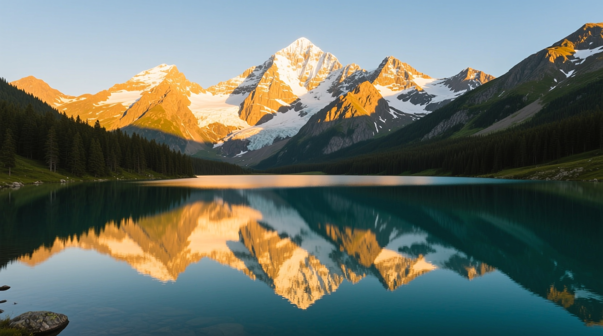
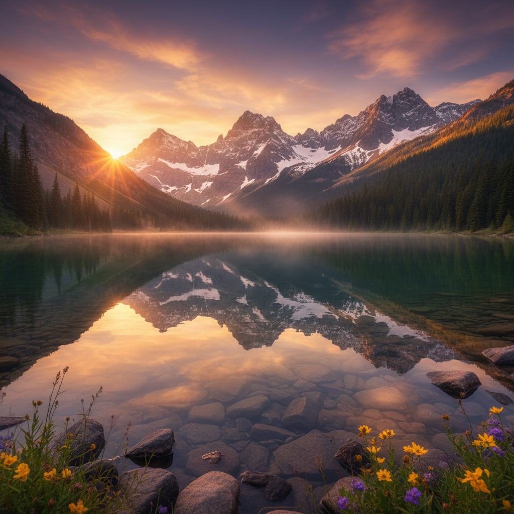

<div align="center">

# 🎨 ImageGen MCP Server

**A powerful MCP server for AI image generation with OpenAI GPT-Image-1, Google Imagen 4, Flux 1.1, Qwen Image, SeedDream-4, and Nano Banana (Gemini 2.5 Flash Image) support**

<p align="center">
  
  
  
</p>

<p align="center">
  <strong>GPT-Image-1 MCP</strong> • <strong>Nano Banana MCP</strong> • <strong>Google Imagen 4 MCP</strong> • <strong>Flux 1.1 MCP</strong>
</p>

<p align="center">
  <code>npx imagegen-mcp-server</code>
</p>

<p align="center">
  <a href="https://writingmate.ai">
    
  </a>
</p>

</div>

---

## 🎬 Quick Demo

### ⚡ Instant (WritingMate.ai)
1. Visit [WritingMate.ai](https://writingmate.ai) 
2. Say: *"Generate an image of a cyberpunk city using Flux 1.1"*
3. ✅ **Done!** - No setup, no API keys needed

### 🛠️ Self-Setup (Other Clients)
```bash
# Install and run in one command
npx imagegen-mcp-server
```

Then in your MCP client:
> *"Generate an image of a cyberpunk city using Flux 1.1"*

✅ **Result**: High-quality image saved to `outputs/` directory

---

An MCP (Model Context Protocol) server for AI image generation supporting:
- **GPT-Image-1 MCP**: OpenAI's latest image generation model
- **Nano Banana MCP**: Gemini 2.5 Flash Image Preview model  
- **Google Imagen 4 MCP**: Advanced photorealistic image generation
- **Flux 1.1 MCP**: State-of-the-art prompt following via Replicate

### 🎨 Model Comparison

*Same prompt: "A serene mountain landscape with a crystal clear lake reflecting snow-capped peaks, golden hour lighting, highly detailed"*

<table>
<tr>
<td width="50%">

<p align="center"><strong>Flux 1.1 Pro MCP</strong><br/><em>black-forest-labs/flux-1.1-pro</em></p>
</td>
<td width="50%">

<p align="center"><strong>Qwen Image MCP</strong><br/><em>qwen/qwen-image</em></p>
</td>
</tr>
<tr>
<td width="50%">

<p align="center"><strong>SeedDream-4 MCP</strong><br/><em>bytedance/seedream-4</em></p>
</td>
<td width="50%">

<p align="center"><strong>Nano Banana MCP</strong><br/><em>Gemini 2.5 Flash Image Preview</em></p>
</td>
</tr>
</table>

## ✨ Features

| Provider | Models | Keywords | Highlights |
|----------|--------|----------|-----------|
| **🤖 OpenAI** | GPT-Image-1, DALL-E 3, DALL-E 2 | `gpt-image-1 mcp`, `openai image gen` | Latest GPT-Image-1 with background control |
| **🧠 Nano Banana** | Gemini 2.5 Flash Image Preview | `nano banana mcp` | Fast generation via official Google SDK |
| **🎨 Google Imagen** | Imagen 4 (custom endpoint) | `google imagen 4 mcp` | Advanced photorealistic image generation |
| **⚡ Replicate** | Flux 1.1 Pro, Qwen Image, SeedDream-4 | `flux 1.1 mcp`, `qwen image mcp`, `seedream-4 mcp` | Multiple cutting-edge models via Replicate |

### 🎯 **Core Capabilities**
- **Multiple Output Formats**: PNG, JPEG, WebP support
- **Flexible Sizing**: Custom dimensions and aspect ratios
- **Base64 & File Output**: Return images as base64 or save to disk  
- **Seed Support**: Reproducible generation with Flux
- **MCP Compatible**: Works seamlessly with any MCP client

### 🆚 **Setup Comparison**

| Client | Setup Required | API Keys | Configuration | Ready Time |
|--------|---------------|----------|---------------|------------|
| **WritingMate.ai** | ✅ **None** | ✅ **Pre-configured** | ✅ **Built-in** | **Instant** |
| Claude Desktop | Manual config | Your own keys | JSON editing | ~5 minutes |
| Claude Code CLI | Command/config | Your own keys | Manual setup | ~5 minutes |
| Other MCP clients | Manual setup | Your own keys | Client-specific | ~5-10 minutes |

## 🚀 Quick Start

### Option 1: Install from npm (Recommended)

```bash
# Install globally
npm install -g imagegen-mcp-server

# Or use with npx (no installation required)
npx imagegen-mcp-server
```

### Option 2: Install from source

```bash
# Clone the repository
git clone https://github.com/writingmate/imagegen-mcp.git
cd imagegen-mcp

# Install dependencies
npm install

# Build the project
npm run build

# Run the server
npm start
```

## Requirements

- Node.js 18+
- API keys: `OPENAI_API_KEY`, `GOOGLE_API_KEY`, and/or `REPLICATE_API_TOKEN`

## Configuration

Create a `.env` file in your project directory:

```env
# Required: OpenAI API Key for DALL-E models
OPENAI_API_KEY=your-openai-api-key-here

# Required: Google API Key for Imagen and Gemini
GOOGLE_API_KEY=your-google-api-key-here

# Required: Replicate API Token for Flux models
REPLICATE_API_TOKEN=your-replicate-api-token-here

# Optional: Custom Google Imagen endpoint
GOOGLE_IMAGEN_ENDPOINT=

# Optional: Output directory for generated images (default: outputs)
OUTPUT_DIR=outputs
```

## 🔧 Setup & Configuration

### 1. Get API Keys

You'll need at least one of these API keys:

| Provider | How to Get API Key | Cost |
|----------|-------------------|------|
| **OpenAI** | [Get OpenAI API Key](https://platform.openai.com/api-keys) | ~$0.02-0.08 per image |
| **Google** | [Get Google API Key](https://aistudio.google.com/app/apikey) | Free tier available |
| **Replicate** | [Get Replicate Token](https://replicate.com/account/api-tokens) | ~$0.003-0.01 per image |

### 2. Configure Environment

Create a `.env` file in your project directory:

```env
# Add the API keys for the providers you want to use
OPENAI_API_KEY=your-openai-api-key-here
GOOGLE_API_KEY=your-google-api-key-here  
REPLICATE_API_TOKEN=your-replicate-api-token-here

# Optional settings
OUTPUT_DIR=outputs
GOOGLE_IMAGEN_ENDPOINT=
```

### 3. Add to Your MCP Client

Choose your preferred MCP client:

#### 🚀 WritingMate.ai (Recommended - Zero Setup!)

**✨ Already installed and configured!** No setup required.

1. Visit [WritingMate.ai](https://writingmate.ai)
2. Start generating images immediately: *"Generate an image of a sunset using Flux"*
3. All providers pre-configured and ready to use

> 💡 **Why WritingMate.ai?** ImageGen MCP Server comes **pre-installed** with all API keys configured. Just start creating!

#### 🖥️ Claude Desktop

**macOS:** `~/Library/Application Support/Claude/claude_desktop_config.json`
**Windows:** `%APPDATA%/Claude/claude_desktop_config.json`

```json
{
  "mcpServers": {
    "imagegen": {
      "command": "npx",
      "args": ["imagegen-mcp-server"]
    }
  }
}
```

#### ⌨️ Claude Code CLI

Add to your MCP configuration:

```bash
# Add to Claude Code MCP settings
claude-code config mcp add imagegen npx imagegen-mcp-server
```

Or manually configure in your Claude Code settings file:

```json
{
  "mcpServers": {
    "imagegen": {
      "command": "npx", 
      "args": ["imagegen-mcp-server"]
    }
  }
}
```

#### 📝 Codeium CLI (Codex)

Add to your Codeium MCP configuration:

```json
{
  "mcp_servers": {
    "imagegen": {
      "command": "npx",
      "args": ["imagegen-mcp-server"],
      "env": {}
    }
  }
}
```

#### 🔧 Other MCP Clients

For any MCP-compatible client, use:

**Command:** `npx imagegen-mcp-server`

**Environment:** Ensure your `.env` file is in the working directory with your API keys.

### 4. Test the Installation

```bash
# Test if the server starts correctly
npx imagegen-mcp-server

# Or if installed globally
imagegen-mcp-server
```

## Available Tools

### 1. OpenAI GPT-Image-1 MCP (`image.generate.openai`)

Generate images using OpenAI's latest GPT-Image-1 model and DALL-E series. This OpenAI image gen MCP tool supports the newest GPT-Image-1 with advanced background control.

**Parameters:**
```typescript
{
  prompt: string;              // Required: Image description
  model?: string;              // "dall-e-2", "dall-e-3", "gpt-image-1" (default)
  size?: string;               // "1024x1024", "1792x1024", "1024x1792", etc.
  width?: number;              // Alternative to size
  height?: number;             // Alternative to size
  quality?: "standard" | "hd" | "low" | "medium" | "high" | "auto";
  format?: "png" | "jpeg" | "jpg" | "webp";
  background?: "transparent" | "opaque" | "auto"; // gpt-image-1 only
  style?: "vivid" | "natural";  // DALL-E 3 only
  returnBase64?: boolean;      // Include base64 in response
  filenameHint?: string;       // Custom filename prefix
}
```

**Model-specific features:**
- **DALL-E 2**: Basic generation, sizes: 256×256, 512×512, 1024×1024
- **DALL-E 3**: High-quality generation, sizes: 1024×1024, 1792×1024, 1024×1792
- **GPT-Image-1**: Latest model with background control, multiple formats, flexible sizing

### 2. Google Imagen 4 MCP (`image.generate.google`)

Generate images using Google's advanced Imagen 4 model via custom endpoint. This Google Imagen 4 MCP integration provides cutting-edge photorealistic image generation.

**Parameters:**
```typescript
{
  prompt: string;              // Required: Image description
  model?: string;              // Model name
  size?: string;               // Image dimensions
  quality?: string;            // Quality setting
  format?: "png" | "jpeg" | "jpg" | "webp";
  returnBase64?: boolean;
  filenameHint?: string;
}
```

**Requirements:**
- Set `GOOGLE_IMAGEN_ENDPOINT` in your `.env` file
- Endpoint should accept POST requests with JSON payload
- Response format: `{ image: { base64: string, mimeType?: string } }`

### 3. Nano Banana MCP (`image.generate.gemini`)

Generate images using Google's Gemini 2.5 Flash Image Preview model (also known as "Nano Banana MCP"). This nano banana implementation provides fast, efficient image generation via Google's official SDK.

**Parameters:**
```typescript
{
  prompt: string;              // Required: Image description
  model?: string;              // Default: "gemini-2.5-flash-image-preview"
  returnBase64?: boolean;
  filenameHint?: string;
}
```

### 4. Replicate Models MCP (`image.generate.replicate`)

Generate images using multiple cutting-edge models via Replicate API:
- **Flux 1.1 MCP**: `black-forest-labs/flux-1.1-pro` (default) - State-of-the-art prompt following
- **Qwen Image MCP**: `qwen/qwen-image` - Advanced AI image generation  
- **SeedDream-4 MCP**: `bytedance/seedream-4` - High-quality diffusion model

**Parameters:**
```typescript
{
  prompt: string;              // Required: Image description
  model?: string;              // Default: "black-forest-labs/flux-1.1-pro"
  width?: number;              // Image width (default: 1024)
  height?: number;             // Image height (default: 1024)
  size?: string;               // Alternative format: "1024x1024"
  format?: "png" | "jpeg" | "jpg" | "webp";
  seed?: number;               // Reproducible generation
  returnBase64?: boolean;
  filenameHint?: string;
}
```

**Flux Model Features:**
- **Flux 1.1 Pro**: State-of-the-art image quality and prompt following
- **High Resolution**: Supports various aspect ratios and sizes
- **Fast Generation**: Optimized for speed and quality
- **Seed Support**: Reproducible image generation

## Examples

### Generate with OpenAI GPT-Image-1

```javascript
const result = await mcpClient.callTool("image.generate.openai", {
  prompt: "A serene mountain landscape at sunset",
  model: "gpt-image-1",
  size: "1536x1024",
  format: "webp",
  background: "transparent",
  quality: "high"
});
```

### Generate with Google Gemini

```javascript
const result = await mcpClient.callTool("image.generate.gemini", {
  prompt: "A futuristic city with flying cars",
  returnBase64: true
});
```

### Generate with Flux 1.1

```javascript
const result = await mcpClient.callTool("image.generate.replicate", {
  prompt: "A detailed portrait of a robot in a cyberpunk setting",
  model: "black-forest-labs/flux-1.1-pro", // Default model
  width: 1024,
  height: 1536,
  seed: 12345,
  format: "png"
});
```

### Generate with Qwen Image

```javascript
const result = await mcpClient.callTool("image.generate.replicate", {
  prompt: "A traditional Chinese landscape painting with mountains and rivers",
  model: "qwen/qwen-image",
  width: 1024,
  height: 1024
});
```

### Generate with SeedDream-4

```javascript
const result = await mcpClient.callTool("image.generate.replicate", {
  prompt: "A vibrant abstract art piece with flowing colors",
  model: "bytedance/seedream-4",
  width: 1024,
  height: 1024 // Minimum 1024x1024 required
});
```

## Output Format

All tools return a consistent response format:

```typescript
{
  content: [
    {
      type: "text",
      text: "provider=openai model=gpt-image-1 saved=/path/to/image.png"
    },
    {
      type: "image",        // Only if returnBase64: true
      data: "base64data",
      mimeType: "image/png"
    }
  ]
}
```

Generated images are automatically saved to the configured output directory with timestamped filenames.

## Publishing to npm

The package is ready for npm publishing:

```bash
# Update version
npm version patch|minor|major

# Publish
npm publish
```

## API Keys Setup

### OpenAI API Key
1. Visit [OpenAI API Keys](https://platform.openai.com/api-keys)
2. Create a new API key
3. Add to `.env` as `OPENAI_API_KEY`

### Google API Key
1. Visit [Google AI Studio](https://makersuite.google.com/app/apikey)
2. Create API key and enable required APIs
3. Add to `.env` as `GOOGLE_API_KEY`

### Replicate API Token
1. Visit [Replicate](https://replicate.com)
2. Sign up and go to your account settings
3. Create an API token
4. Add to `.env` as `REPLICATE_API_TOKEN`

## Development

```bash
npm install    # Install dependencies
npm run dev    # Development with hot reload
npm run build  # Build for production
npm start      # Start production server
```

## License

This project is licensed under the MIT License - see the [LICENSE](LICENSE) file for details.

---

<div align="center">

### 💡 Brought to you by

**[WritingMate.ai](https://writingmate.ai)** - All-in-One AI Platform

*The team behind WritingMate.ai brings you powerful AI tools and integrations*

[](https://writingmate.ai)

</div>
